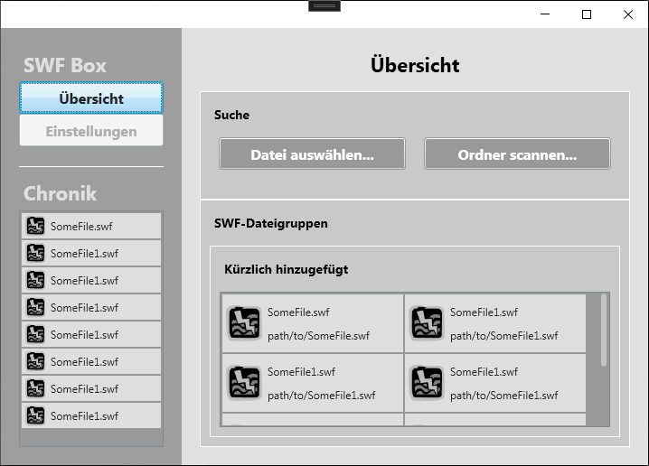

# SWF Box

A Windows Desktop application to view SWF files, e.g. for the purpose of playing old flash games. Analyzing SWF files is also a planned feature.

Moreover, this project shall demonstrate my skills with WPF and MVVM.

# Preview

So far 2 pages are integrated:

- SWF-Details page
- Overview page

# UML

# Mockup

